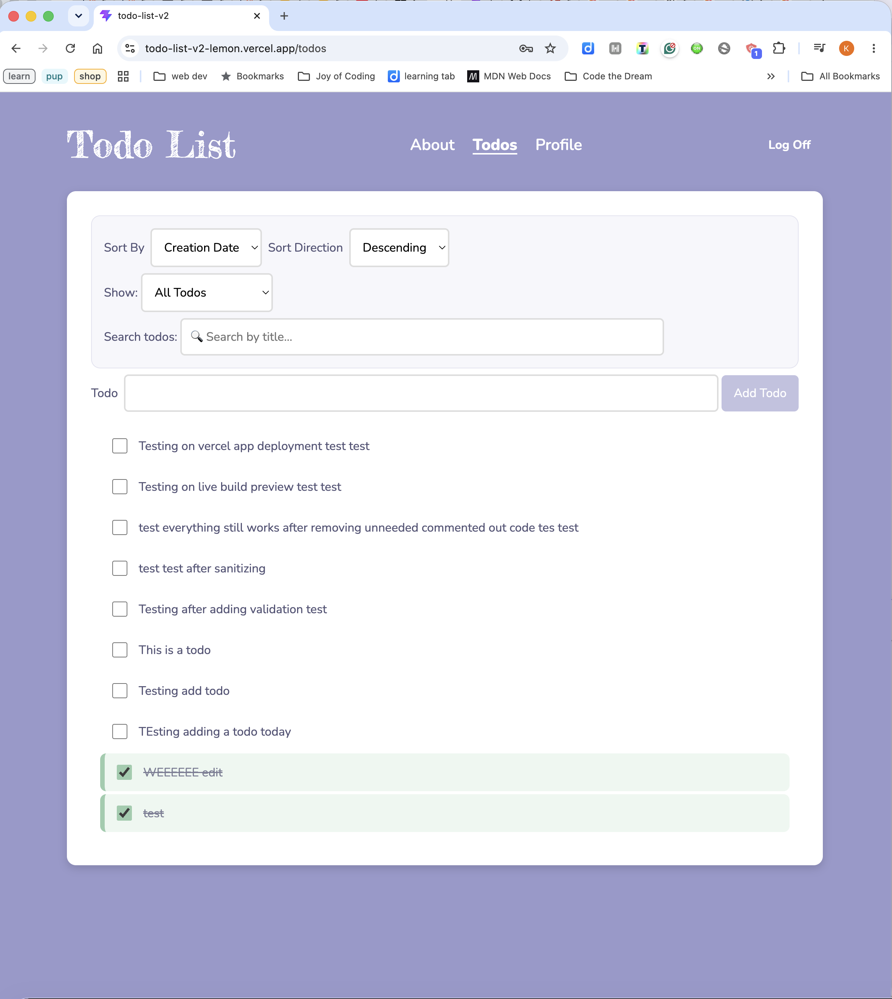
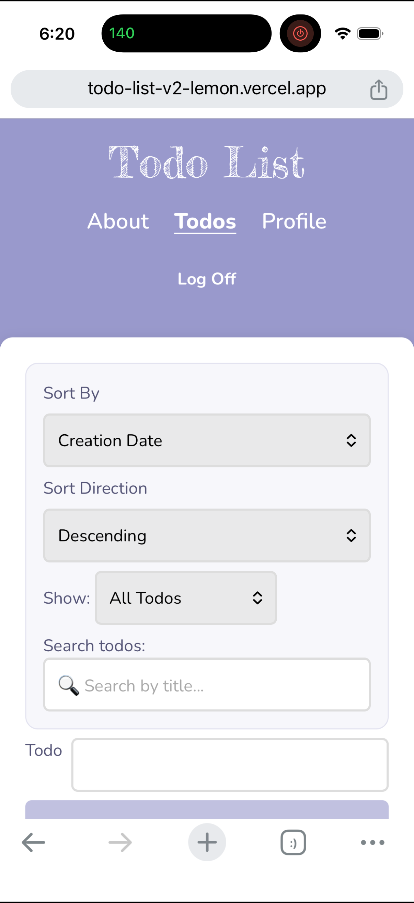
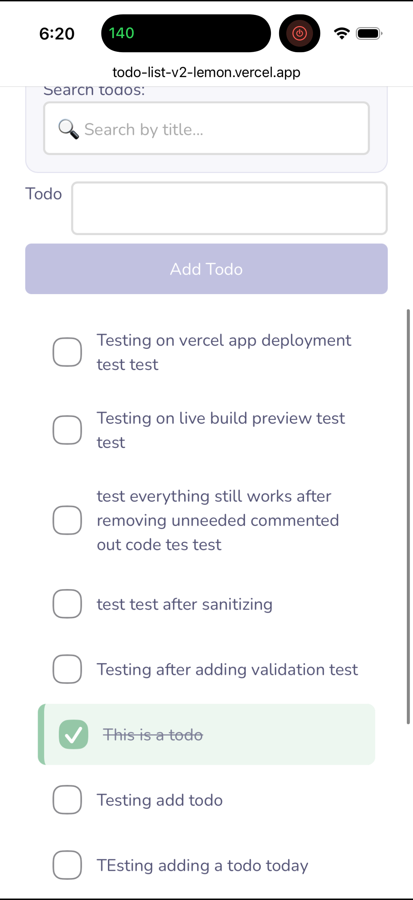

# To Do List

This is a To Do List React SPA (single page application).
Account sign up for local and live deployment available at https://react-todo-list-v4-snowy.vercel.app/

## Live Deployment Demo link

https://todo-list-v2-lemon.vercel.app/

## Getting Started

### Installation Instructions

To install the needed dependencies, run the following command:
npm install

### How To Run The Development Server

To run the development server, run the following command:
npm run dev

The location for the local host will appear in the terminal.

### Available Scripts

npm run dev - run the development server
npm run build - run the build server
npm run preview - acquire the build server local URL

## Features List

• Login to account  
• Add todo to list  
• Access previously added todos  
• Complete todo  
• Edit todo  
• Sort and filter todos
• View account information and statistics

## Technologies Used

React, React Router, Vite

## Design Decisions

I used to be a web designer, but even so I struggle to let my perfectionism go when it comes to design. I want to create something beautiful and unique, but also functional. Here, I focused on my color palette starting with a lavender flint-ish color and then complimenting shades of yellow, green, pink, and a darker purple. I kept the main content section easy to read with a white background, with the header elements using the main color as a backdrop. Rounded corners make the design more fun and non-stuffy. Imported Google fonts (Nunito and Fredericka the Great) polish off the design.

## Screenshots

## Future Improvements

x. Delete todos  
x. Add sub-todos (tasks)

## License Information

This project is licensed under the MIT License.

## Contact Information

https://github.com/kelliwisethebrave
